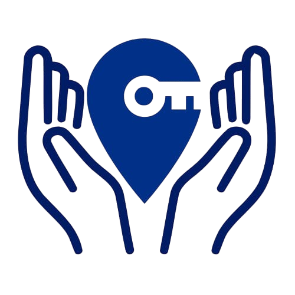

<a name="readme-top">

<br/>

<br />
<div align="center">
  <a href="https://github.com/zyx-0314/">
  <a href="https://github.com/zyx-0314/">
  <a href="https://github.com/zyx-0314/">
  <a href="https://github.com/zyx-0314/">
  <a href="https://github.com/zyx-0314/">
    
  </a>

  <h3 align="center">Volunkey</h3>
</div>

<div align="center">
  The goal is to connect volunteers with opportunities to positively impact communities through coordinated events and initiatives.
</div>

<br />


---

<br />
<br />

<details>
  <summary>Table of Contents</summary>
  <ol>
    <li>
      <a href="#Home">Home</a>
      <ol>
        <li>
          <a href="#Services">Services</a>
        </li>
        <li>
          <a href="#AboutUs">About Us</a>
        </li>
      </ol>
    </li>
    <li>
      <a href="#rule,-practices-and-principles">Rules, Practices and Principles</a>
    </li>
    <li>
      <a href="#resources">Resources</a>
    </li>
  </ol>
</details>

---

## Overview


Description of the project in details.

Guiding Question:
- What is the project
- Whats the purpose
- What are key components
- What technology used and how it is used

### Key Components
- MultiPage Website/Single Page Website
- Parallax transition
- Transactional

### Technology


```
WD-ProjectName
└─ assets
|   └─ css
|   |   └─ style.css
|   └─ img
|   |   └─ fileWith.jpeg/.jpg/.webp/.png
|   └─ js
|       └─ script.js
└─ pages
|  └─ pageName
|     └─ assets
|     |  └─ css
|     |  |  └─ style.css
|     |  └─ img
|     |  |  └─ fileWith.jpeg/.jpg/.webp/.png
|     |  └─ js
|     |     └─ script.js
|     └─ index.html
└─ index.html
└─ readme.md
```

## Resources
| Title | Purpose | Link |
|-|-|-|
| Github | Template | https://github.com/FEU-TECH-Advance-Web-Design-Ramirez/AWD-Template-Project.git |

